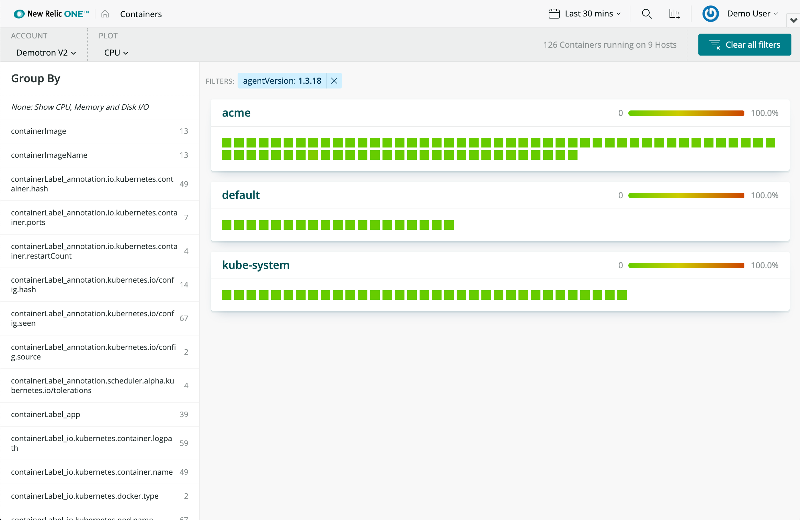
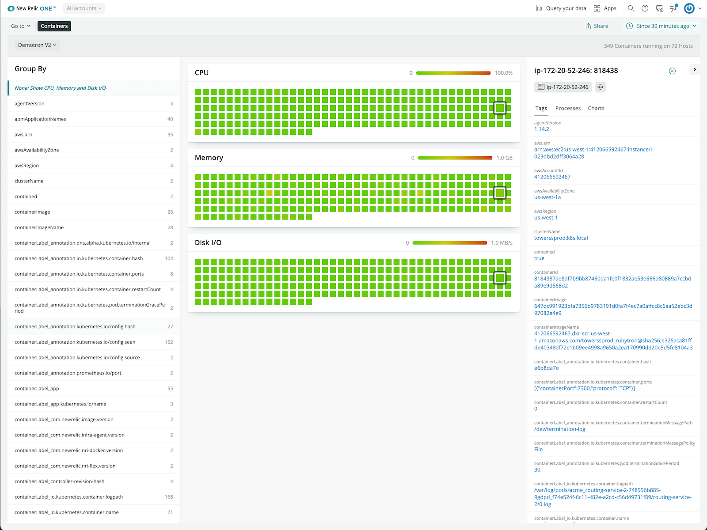

[](https://opensource.newrelic.com/oss-category/#new-relic-one-catalog-project)

# New Relic Container Explorer

  [](https://snyk.io/test/github/newrelic/nr1-container-explorer)

View and manage millions of containers in context.

## Usage

Container Explorer displays a global view of all of the containers in an account.

CPU, Memory and Disk I/O is presented in a space efficient heat map.

Clicking on a node in the heatmap displays details about that container, and jumps to its host in the entity explorer.





## Dependencies

Requires [`New Relic Infrastructure`](https://newrelic.com/products/infrastructure) agent deployed on hosts running Docker containers.
Requires `node 16`

## Caveats

We generate per-container CPU etc by summarizing all processes in a given containerId. For example, this query
will report CPU for a single container for the last minute:

```sql
SELECT sum(cpuPercent) FROM ProcessSample WHERE containerId = '${containerId}'
    SINCE 1 minute ago UNTIL 30 seconds ago
```

**However:** This will report an accurate value _only if the agent reports one ProcessSample_ per process
every 30 seconds. If the agent reports once every 15 second, then we would get 2x the value for this query.
I'm looking to add a capability to estimate the reporting rate per process per container, but note that this
reporting rate can vary by host depending on agent config.

If a set of viewed containers all report a the same rate heatmap colorization will be consistent irrespective of
an agent's reporting rate. But the reported absolute values may be off.

The infrastructure team is working on agent changes that will properly report by container, at which point
we can convert to using that data.

## Enabling this App

This App is available via the New Relic Catalog. 

To enable it in your account: 
1. go to `Add Data > Apps and Visualzations` and search for "Container Explorer"
2. Click the `Container Explorer` card, and then click the `Add this App` button to add it to your account(s)
3. Click `Open App` to launch the app (note: on the first time accessing the app, you may be prompted to enable it)

Once you have added your accounts, you can also open the app by:
1. Open the `Apps` left-hand navigation menu item (you may need to click on the `Add More` ellipsis if it doesn't show up by default)
2. In the `Your Apps` section, locate and click on the `Container Explorer` card to open the app 


#### Manual Deployment
If you need to customize the app, fork the codebase and follow the instructions on how to [Customize a Nerdpack](https://developer.newrelic.com/build-apps/customize-nerdpack). If you have a change you feel everyone can benefit from, please submit a PR!

## Support

<a href="https://github.com/newrelic?q=nrlabs-viz&amp;type=all&amp;language=&amp;sort="></a>

This project is actively maintained by the New Relic Labs team. Connect with us directly by [creating issues](../../issues) or [asking questions in the discussions section](../../discussions) of this repo.

We also encourage you to bring your experiences and questions to the [Explorers Hub](https://discuss.newrelic.com) where our community members collaborate on solutions and new ideas.

New Relic has open-sourced this project, which is provided AS-IS WITHOUT WARRANTY OR DEDICATED SUPPORT.

## Security

As noted in our [security policy](https://github.com/newrelic/nr1-container-explorer/security/policy), New Relic is committed to the privacy and security of our customers and their data. We believe that providing coordinated disclosure by security researchers and engaging with the security community are important means to achieve our security goals.
If you believe you have found a security vulnerability in this project or any of New Relic's products or websites, we welcome and greatly appreciate you reporting it to New Relic through [HackerOne](https://hackerone.com/newrelic).

## Contributing

Contributions are welcome (and if you submit a Enhancement Request, expect to be invited to contribute it yourself :grin:). Please review our [Contributors Guide](CONTRIBUTING.md).

Keep in mind that when you submit your pull request, you'll need to sign the CLA via the click-through using CLA-Assistant. If you'd like to execute our corporate CLA, or if you have any questions, please drop us an email at opensource@newrelic.com.

## Open Source License

This project is distributed under the [Apache 2 license](./LICENSE).
